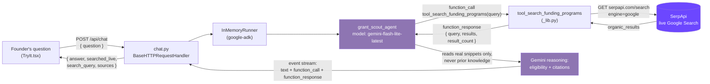
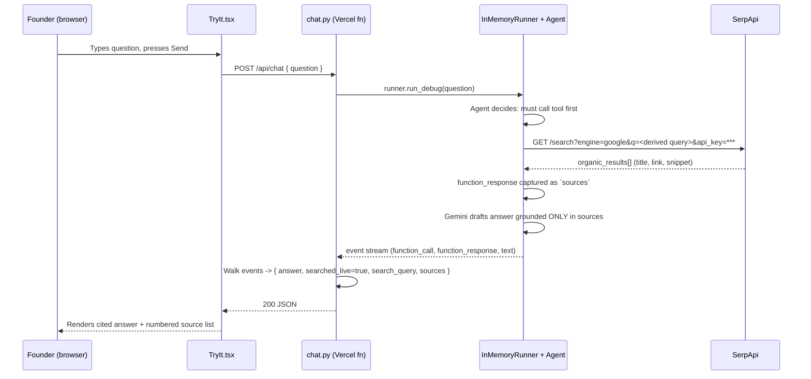

<div align="center">

# Grant Scout

### Live Search In. Cited Funding Out. Zero Fabricated Grants.

If you're a solo, non-incorporated founder, every "AI grant finder" you've tried has the same failure mode: it recalls funding programs from training data, half of which no longer exist, require an LLC you don't have, or were never real. Grant Scout doesn't recall - it **searches**. Every question triggers a live Google Search through SerpApi at request time; Gemini reviews only the returned titles, URLs, and snippets, sorts them for non-incorporation eligibility, and cites the real result URL behind every program it mentions.

<p>
  <a href="https://grant-scout-jayblast.vercel.app"></a>
  <a href="https://github.com/jayblast-spec/grant-scout"></a>
</p>

<p>
  
  
  
  
  
  
  
  
</p>

<p>
  
</p>

</div>

## What It Does

Grant Scout lets a solo founder ask a plain-language question - *"what grants can I apply for as a non-incorporated developer-tools founder in the US"* - and get back a live-search-grounded answer instead of a hallucinated list. The agent runs a real Google Search through SerpApi at request time, then uses Gemini to review the returned titles, URLs, and snippets, sort out which ones plausibly don't require a registered legal entity, and explain its reasoning with the real result URL attached. It does not claim to have opened the linked pages; ambiguous eligibility is flagged for the founder to verify.

## How It Works

Built on Google's Agent Development Kit (`google-adk`) running a single `Agent` (defined in [`frontend/api/_lib.py`](frontend/api/_lib.py)) with exactly one tool: `tool_search_funding_programs`, which calls SerpApi's Google Search API (`https://serpapi.com/search`) live and returns the real organic results - title, link, and snippet, capped at ten. The agent's system instruction is explicit that this tool call is mandatory before every answer and that the search results are its *only* source of truth; nothing is permitted from prior knowledge. The model is `gemini-flash-lite-latest`, served through the free Gemini Developer API rather than Vertex AI (`GOOGLE_GENAI_USE_VERTEXAI=False` is set at import time) - the free-tier path was sufficient for the latency and cost profile this agent needs and avoids a GCP project/billing setup entirely.

In production, [`frontend/api/chat.py`](frontend/api/chat.py) runs the same agent inside a single Vercel Python serverless function (a plain `BaseHTTPRequestHandler`, no framework), driving it with ADK's `InMemoryRunner`. It replays the run's event stream to recover three things the frontend needs: whether the search completed with usable sources (`searched_live`), the exact query the agent chose to run, and the raw `results` list from the tool's function response - which becomes the linked result list, independent of whatever prose the model wrote. That JSON is served to the Next.js chat UI ([`frontend/components/gs/TryIt.tsx`](frontend/components/gs/TryIt.tsx)) in the same deployment - no separate agent-hosting infrastructure. Demo prompts use fictional founder scenarios and are not retained by the public application.

### Architecture



### Sequence: one real example query

The trace below is the actual code path for the example prompt *"Grants for a solo, non-incorporated founder building developer tools in the US"* - the request/response shapes come directly from `_lib.py` and `chat.py`, not a simplified stand-in.



<details>
<summary><strong>See a synthetic response fixture</strong></summary>

The payload below is fictional test data for documenting the response contract. It was not captured from a user or production request:

```json
{
  "searched_live": true,
  "search_query": "fictional grant program for an individual founder",
  "answer": "The returned snippet suggests this fictional program may accept individuals. Confirm eligibility, deadline, and terms on the linked program page before applying.",
  "sources": [
    {
      "title": "Example Founder Grant",
      "link": "https://example.com/grants/founders",
      "snippet": "A fictional snippet used only to illustrate the API shape."
    }
  ]
}
```

The fixture deliberately distinguishes snippet-level evidence from details that require verification on the linked page.

</details>

## Try It Live

**[grant-scout-jayblast.vercel.app](https://grant-scout-jayblast.vercel.app)**

Ask it something like:

> Grants for a solo, non-incorporated founder building developer tools in the US

Watch the pipeline status ticket - query received, live search running, Gemini reasoning over results, cited answer ready - then check the numbered source list underneath every answer. Every link there is exactly what SerpApi returned for that request.

## Tech Stack

| Layer | Technology |
|---|---|
| Agent orchestration | Google Agent Development Kit (`google-adk>=2.7.1`) |
| Model | Gemini Flash Lite (`gemini-flash-lite-latest`), free Gemini Developer API |
| Live grounding | SerpApi (Google Search API, `engine=google`) |
| Backend | Python `http.server` handler as a Vercel serverless function |
| Frontend | Next.js 16, React 19, TypeScript |
| Hosting | Vercel (frontend + Python function, one deployment) |

<details>
<summary><strong>Engineering notes: things that weren't obvious going in</strong></summary>

- **SerpApi's free plan gates key activation behind phone verification.** The signup itself doesn't hand you a working key - the account has to clear a phone-verification step before `SERPAPI_KEY` starts returning real `organic_results` instead of an auth error. Worth budgeting a few minutes for this before your first test call, not during a demo.
- **Gemini via the free Developer API, not Vertex AI.** `_lib.py` sets `GOOGLE_GENAI_USE_VERTEXAI=False` before the ADK agent is constructed. That one line is the difference between "needs a GCP project, billing account, and IAM setup" and "needs an API key." For a single-agent, single-tool product like this, the Developer API path was the right tradeoff.
- **`chat.py` re-derives structured data from an unstructured event stream.** ADK's `InMemoryRunner.run_debug` returns a list of events, not a clean response object. The handler requires exactly one matching function response with at least one usable result before returning `searched_live: true`; the linked results remain separate from the model's prose.
- **`lucide-react` dropped its brand/logo icon set** (including a dedicated `Github` icon) in recent major versions. `SiteHeader.tsx` links out to GitHub using plain text plus an `ArrowUpRight` icon rather than importing a brand glyph - a small thing, but it'll trip up anyone who reaches for `<Github />` from `lucide-react` expecting it to still be there.

</details>

<div align="center">


</div>
